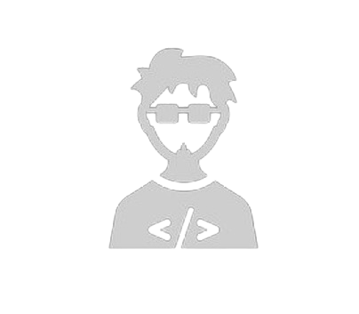

# My Portfolio Site

- Site logo

  

- Me

  

## Getting Started

- Note!
  - If you do not have `yarn` installed locally globally, you can use

    ```bash
    npx yarn <command or script>
    ```

First, install dependencies:

```bash
yarn
# or
yarn install
```

Now, run the development server with:

```bash
yarn dev
```

To, run the development tests with with jest, run:

```bash
yarn test
# or
yarn test:watch # in watch mode
```

### I'm currently running tests only for

- The Banner section,
- The About section and,
- The Testimonials section

## Live vercel deployment

- coming soon...
